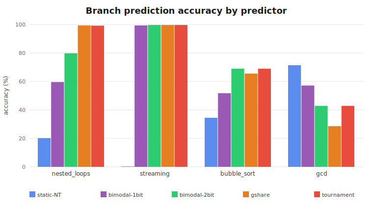
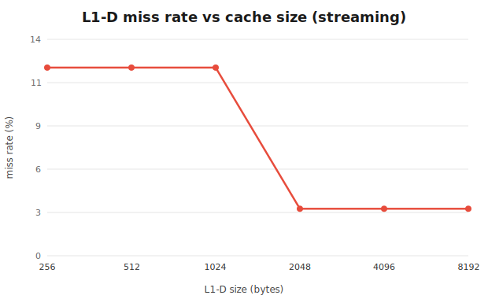

# Custom ISA — Assembler, Emulator & Microarchitecture Simulator

A toolchain and cycle-accurate performance model for a custom 32-bit instruction
set, written in C11 with no dependencies beyond libc (~1,900 lines of C, plus
~600 of tests). You write assembly, the assembler produces a binary, and three
tools consume it:

- **`asm`** — two-pass assembler (labels, directives, error checking)
- **`emu`** — functional emulator with trace mode and instruction-throughput stats
- **`disasm`** — disassembler (binary → assembly, round-trip verified)
- **`pipe`** — microarchitecture simulator: a structural 5-stage pipeline with
  hazard detection, forwarding, **four branch predictors + a tournament chooser**,
  and a **configurable cache hierarchy**, reporting CPI, MPKI, miss rate, and AMAT

```
  program.asm ──▶ [ asm ] ──▶ program.bin ──┬──▶ [ emu ]    functional run + MIPS
                  2-pass                     ├──▶ [ disasm ] binary → assembly
                                             └──▶ [ pipe ]   pipeline + bpred + caches
```

## Build & test

```sh
make          # builds asm, emu, disasm, pipe into build/
make test     # CPU, assembler, integration, pipeline, and round-trip suites
```

## Quick start

```sh
./build/asm examples/bubble_sort.asm -o bs.bin
./build/emu --stats bs.bin                  # run; print instruction count + MIPS
./build/disasm bs.bin                        # annotated disassembly
./build/pipe bs.bin                          # full pipeline/predictor/cache report
./build/pipe --predictor gshare --l1d 2048:4:32 bs.bin --csv   # one configured run
```

---

## Instruction set architecture

32-bit fixed-width instructions: 6-bit opcode, two 3-bit register fields, 20-bit
sign-extended immediate. Registers `R0`–`R7`, `PC`, `SP`, and `FLAGS` (Zero,
Carry, Overflow, Negative). Memory is 64 KB, byte-addressable, little-endian;
the stack grows down from the top.

| Category         | Mnemonics                                       |
|------------------|-------------------------------------------------|
| Arithmetic/logic | ADD SUB MUL DIV AND OR XOR NOT SHL SHR          |
| Data movement    | MOV LOAD STORE LOADI PUSH POP                   |
| Control flow     | JMP JZ JNZ JG JL CALL RET                       |
| System           | NOP HALT IN OUT                                 |

```asm
        LOADI R0, 5        ; immediate (decimal or 0x hex, may be negative)
loop:                      ; label
        LOAD  R1, [R2+4]   ; base + offset memory access
        JNZ   loop         ; labels resolve to addresses
.org 256
arr:    .word 42           ; data directive
```

---

## Microarchitecture simulator

`pipe` uses a decoupled functional + timing design. A reference CPU executes the
program, so architectural results are correct by construction; the captured
instruction stream (with real branch outcomes and memory addresses) then drives
a structural timing model.

- **Pipeline** — five stages (IF/ID/EX/MEM/WB) advanced one cycle at a time with
  explicit stage latches. A hazard-detection unit inspects the EX/MEM latches; a
  forwarding toggle switches between full EX/MEM forwarding (only load-use stalls
  remain) and none (a consumer waits until its producer reaches WB). Flags are
  modeled as a 9th register so flag-setter → conditional-branch dependencies count.
- **Branch prediction** — static-not-taken, 1-bit, 2-bit bimodal, gshare
  (global-history XOR PC), and a **tournament** predictor whose chooser selects
  between bimodal and gshare per context; plus a BTB for targets. Mispredictions
  drive the flush penalty.
- **Caches** — configurable L1 I/D (size, block, associativity, LRU/FIFO/random
  replacement); misses stall the relevant stage and feed AMAT.

### Methodology & validation
- **Oracle equality** — the simulator's final register and memory state is
  asserted equal to an independent `cpu.c` run on every benchmark.
- **Analytical cross-check** — pipeline cycle counts are locked against a
  hand-derived model (this caught a retirement off-by-one during development).
- **37 timing assertions** across pipeline, predictor, cache, and tournament tests.

---

## Results

Measured on the bundled benchmark suite via `tools/run_suite.sh`. Regenerate the
data and charts with `make && sh tools/run_suite.sh && python3 tools/plot.py`.

### Throughput (functional emulator)
~**67 MIPS** — 20,000,063 instructions in 0.30 s.

### Forwarding
Forwarding yields **1.34×–1.71×** by removing data-hazard stalls. The remaining
stalls are load-use hazards, which forwarding cannot eliminate.

| Program | CPI no-fwd | CPI fwd | Speedup |
|---|--:|--:|--:|
| fibonacci | 2.09 | 1.33 | 1.57× |
| bubble_sort | 2.08 | 1.38 | 1.50× |
| nested_loops | 1.71 | 1.05 | 1.63× |
| streaming | 1.93 | 1.13 | 1.71× |

### Branch prediction


The ordering depends on the workload:

- **Correlated branches** (`nested_loops`, a short fixed inner loop): gshare
  learns the repeating `T,T,T,N` pattern and reaches **99.4%**, vs. 79.8% for
  bimodal and 20% for static. It predicts the loop exits, which a per-PC counter
  cannot.
- **Predictable loops** (`streaming`): every dynamic predictor reaches ~99.5%.
- **Tiny / data-dependent code** (`gcd`, `recursive`): dynamic predictors lose to
  static-not-taken. There are too few branches to warm up, and a {bimodal, gshare}
  tournament cannot recover when both components mispredict.
- **Tournament** is never worse than its worse component and tracks the better one
  (nested_loops 99.2% ≈ gshare; bubble_sort matches bimodal).

### Caches — the capacity cliff


`streaming` sweeps a 1.6 KB array three times. While L1-D is smaller than the
working set the array re-misses every pass (**12.5%**); once it fits (≥ 2 KB) only
first-pass compulsory misses remain (**3.1%**), and CPI drops 1.30 → 1.16.

---

## Project layout

```
include/   isa.h cpu.h memory.h assembler.h bpred.h cache.h pipe_sim.h
src/       cpu.c memory.c isa.c                 # emulator core
           lexer.c parser.c encoder.c          # assembler (two-pass)
           bpred.c cache.c pipe_sim.c          # microarchitecture model
           main_emu.c main_asm.c disasm.c main_pipe.c
examples/  factorial fibonacci bubble_sort nested_loops gcd recursive streaming
tests/     test_cpu_core test_assembler test_integration test_pipe roundtrip.sh
tools/     run_suite.sh (CSV sweeps)  plot.py (SVG charts)
```

## Future work
- Tournament with a static fallback (recover the gcd/recursive cases)
- Out-of-order (Tomasulo) or 2-wide superscalar issue
- Unified L2 and a memory-mapped I/O model
